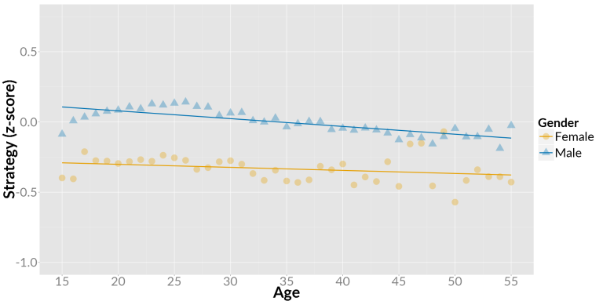
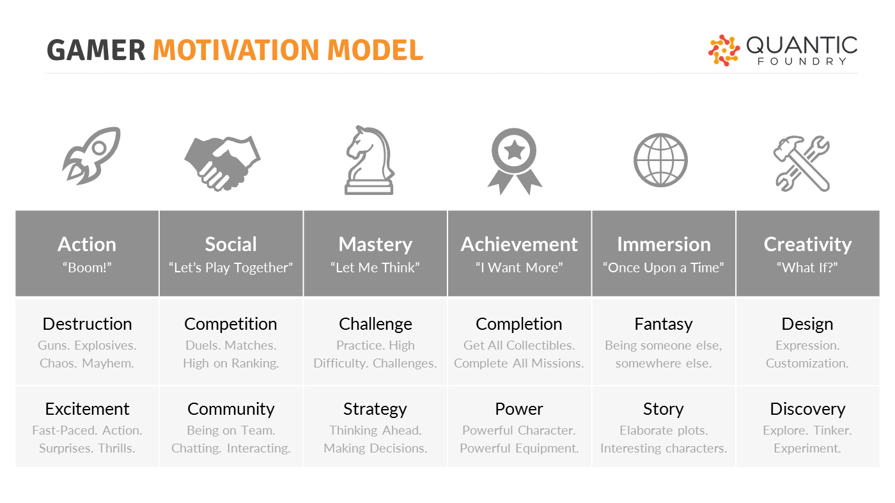

# Motivation behind competition in games
As gamers age, the movating power behind competition drops faster than the motivation behind strategy. [Strategy is The Most Age-Stable Motivation.](http://quanticfoundry.com/2016/02/10/gamer-generation/)

[Source](http://quanticfoundry.com/2016/02/10/gamer-generation/)

Strategy and competition are two parts of the gamer motivation model developed by Quantic Foundry.

[Link to Quiz](https://apps.quanticfoundry.com/lab/10#)

